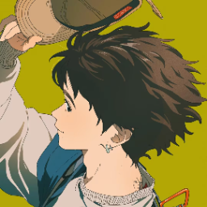
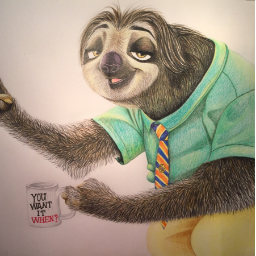

# 简道云-前端代码规范指南

## 章节内容


[ming-ming-gui-fan.md](ming-ming-gui-fan.md)



[han-shu-gui-fan.md](han-shu-gui-fan.md)



[react-gui-fan.md](react-gui-fan.md)



[pug-gui-fan.md](pug-gui-fan.md)



[zui-jia-shi-jian.md](zui-jia-shi-jian.md)


## 名词解释

| **术语** | **Emoji** | **解释**          |
| ------ | --------- | --------------- |
| 必须     | ✅         | 除非是非常特殊的情况，必须执行 |
| 禁止️    | ⛔         | 除非是非常特殊的情况，禁止使用 |
| 建议     | 👍        | 建议这样使用，但没有那么严格  |
| 不建议    | 🤔        | 不建议这样使用，但没有那么严格 |
| 可选     | 🔄        | 在你的模块/领域下保持一致即可 |

参考：



## 参考文献

* 前端开发白皮书 [https://kms.fineres.com/x/mIBNFg](https://kms.fineres.com/x/mIBNFg)
* 前端组内书写风格讨论 [https://kms.fineres.com/x/bMCeQw](https://kms.fineres.com/x/bMCeQw)
* 《Clean Code》

## 鸣谢

<figure><figcaption></figcaption></figure> <figure><figcaption></figcaption></figure> <figure><figcaption></figcaption></figure> <figure><figcaption></figcaption></figure> <figure><figcaption></figcaption></figure> <figure><figcaption></figcaption></figure> <figure><figcaption></figcaption></figure> <figure><figcaption></figcaption></figure> <figure><figcaption></figcaption></figure> <figure><figcaption></figcaption></figure> <figure><figcaption></figcaption></figure> <figure><figcaption></figcaption></figure> <figure><figcaption></figcaption></figure> <figure><figcaption></figcaption></figure> <figure><figcaption></figcaption></figure> <figure><figcaption></figcaption></figure>

